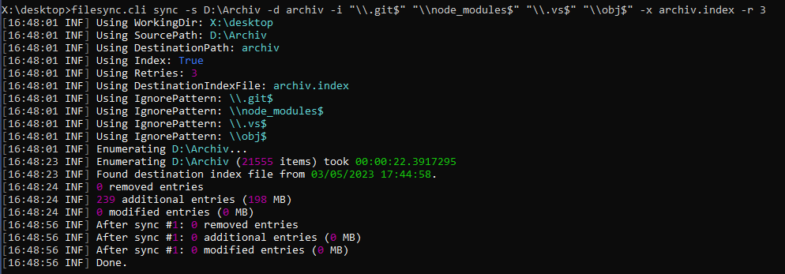
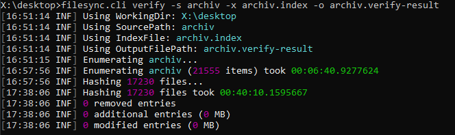

# FileSync

Open Source indexing / backup command line utility.

```
FileSync.Cli 1.0.0
Copyright (C) 2023 FileSync.Cli

  sync       Synchronizes two directories

    -s, --sourcePath    Required. Source path for synchronization

    -d, --destPath      Required. Destination path for synchronization

    -i, --ignore        Ignored file pattern (Regex)

    -x, --indexFile     File path for an index file to use

    -r, --retries       Number of sync retries if errors occured

  index      Creates a file index

    -s, --sourcePath    Required. Source path for indexing

    -i, --ignore        Ignored file pattern (Regex)

    -x, --indexFile     Required. File path for an index file to use

    -c, --checksum      Generate checksums

  verify     Verifies a folder against an image file (diff + check md5s)

    -s, --sourcePath    Required. Source path that should be verified

    -i, --ignore        Ignored file pattern (Regex)

    -x, --indexFile     Required. Index file used for verification

    -o, --output        Required. Output file for diff result

``` 

# What problems does it solve?

## Backups to a NAS are too slow.

`robocopy /mir` often took hours to synchronize weekly backups from my PC to a NAS, mostly because robocopy [often detects changes when there aren't any](https://www.google.com/search?q=robocopy+detects+files+as+modified).

FileSync will do that backup job in under a minute (17.000 files / 100 GB).



## Detect file corruption / bit rotting.

FileSync tracks MD5 hashes for every file in it's index. The `verify` feature verifies that the file you have now is exactly the file you backed up years ago.

Bit rotting in long term backups is no hypothetical thing. It's real.



## Detect copy errors.

FileSync generates the checksum for a file, copies it to the destination and reads it again to verify the checksum. It might sound paranoid but I really have those kind of errors every now and then.

## Indexing folders.

Not interested in backups at all? Just use the `index` feature. It just reads directory contents and generates a human readble, easy-to-parse index file.

```
File|Videos\2021-05.mp4|637649517973959438|637649524666341628|590509491|9fc8af7f017ff963ce32aeb2deadbeef
File|Videos\2021-06.mp4|637658275811507443|637658278755313291|306253946|5110225454deadbeef4c438b3672e9fb
File|Videos\2021-07.mp4|637684189714853357|637684195736885887|841857480|e8e5ffe4d5e4e900bdeadbeef7fc97a9
File|Videos\2021-08.mp4|637691220143788232|637691231835483562|826861681|d60adeadbeef02eab490037320d97b5c
```

(Type | Path | Created | Modified | Size | MD5 )